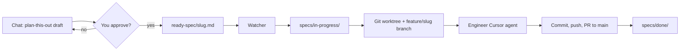

# Realistic Food Photo Generator

This repository combines two related pieces:

| Package | Purpose |
|---------|---------|
| [`food-photo-generator/`](food-photo-generator/) | The product: a web app that turns a dish description into a photorealistic food image while avoiding common AI “slop” artifacts. |
| [`agent-workflow/`](agent-workflow/) | Local automation: run Cursor **engineer** agents on written feature specs in isolated git worktrees, with a small dashboard to watch jobs. |

Environment files are per package (see [`.env.example`](.env.example)): copy `food-photo-generator/.env.example` and `agent-workflow/.env.example` into each folder’s `.env` and set `CURSOR_API_KEY` where needed.

---

## Food photo generator

The app takes a text prompt (for example, “nasi lemak with fried chicken”) and runs a **LangGraph.js** pipeline instead of generating directly from the prompt:

1. Search real reference photos (Openverse / Wikimedia).
2. A Cursor agent screens candidates (real vs. likely AI, relevant vs. not).
3. A **human** approves or rejects references (with round caps).
4. A Cursor agent writes a generation prompt grounded in approved photos.
5. A Cursor agent generates the image.
6. A **human** approves or rejects the result (with retry limits).

The graph pauses at human gates via LangGraph `interrupt()` and resumes when the UI submits a decision.

**Stack:** Node + Express, React + Vite, Tailwind + shadcn/ui, `@cursor/sdk`, Vitest.

Full pipeline diagram, layout, and local run instructions: [`food-photo-generator/README.md`](food-photo-generator/README.md).

---

## Agent workflow

`agent-workflow/` is the **spec → implementation** factory for this repo. You drop an engineer-ready markdown spec into an inbox; a file watcher queues work, creates a dedicated git worktree and `feature/<slug>` branch from `origin/main`, and runs a Cursor agent configured as a senior engineer ([`personas/engineer.md`](agent-workflow/personas/engineer.md)).

Typical layout:

| Path | Role |
|------|------|
| `agent-workflow/ready-spec/` | Inbox — new specs land here |
| `agent-workflow/specs/in-progress/` | Spec currently being built |
| `agent-workflow/specs/done/` | Completed specs (archive) |
| `agent-workflow/data/` | Job registry and logs (gitignored) |

On success, the engineer agent commits in the worktree, pushes, and opens a PR to `main` using [`.github/pull_request_template.md`](.github/pull_request_template.md). You need `gh` authenticated and push access to `origin`.

**Run the workflow:** `cd agent-workflow && npm install && npm run dev` (API + UI + watcher). Headless watcher + API only: `npm run worker`. Details: [`agent-workflow/README.md`](agent-workflow/README.md).

---

## How a feature gets implemented (plan → approve → build)

Most product changes are meant to flow through a written spec and the agent pipeline—not ad-hoc edits on `main`.

### 1. Plan with **plan-this-out**

In Cursor, invoke the [**plan-this-out**](.cursor/skills/plan-this-out/SKILL.md) skill (e.g. “plan this out”, “write a spec for the inbox”). The agent will:

- Explore the repo (real files, tests, current behavior).
- Draft a full spec in chat (summary, context, work phases, checklist, risks)—no placeholders.
- **Stop and wait** for your explicit approval of **that draft** (e.g. “yes”, “approve”, “lgtm”). The original request to “write a spec” is not approval by itself.

The skill does **not** implement the feature; it only produces an approved spec.

### 2. Approve and drop into the inbox

After you approve the draft, the agent saves:

`agent-workflow/ready-spec/<kebab-case-slug>.md`

If `npm run dev` or `npm run worker` is already running in `agent-workflow/`, the watcher picks up the file automatically. You can also copy a spec into `ready-spec/` yourself if you wrote it outside Cursor.

### 3. Pipeline builds the feature



Step by step:

1. **Pickup** — [`readySpecWatcher`](agent-workflow/server/services/readySpecWatcher.ts) sees a new `*.md` in `ready-spec/` (ignores `README.md` and `*.example.md`).
2. **Lifecycle** — The spec moves to `specs/in-progress/` and a job is enqueued.
3. **Isolation** — `git fetch origin main`, then a worktree under `.worktrees/<slug>` on branch `feature/<slug>`.
4. **Engineer run** — [`engineerRunner`](agent-workflow/server/services/engineerRunner.ts) starts a Cursor agent with the engineer persona and the full spec body; work happens in the worktree (usually under `food-photo-generator/` when the feature is product work).
5. **Finish** — Watch the dashboard (`http://localhost:5174` by default) or `agent-workflow/data/logs/<slug>.log`. On success, the spec moves to `specs/done/`; review and merge the PR.

**CLI:** `npm run feature -- list|status|reconcile|run` from `agent-workflow/` for job inspection and retries.

### Optional: implement in chat instead

If you want the **current** Cursor chat to implement something without the pipeline, say so explicitly—that is separate from plan-this-out. Do not put half-baked specs in `ready-spec/` unless you intend the watcher to start an engineer run immediately after save.

---

## Repository map (high level)

```
food-photo-generator/   # LangGraph food-photo app (primary product)
agent-workflow/         # Spec inbox, watcher, job queue, engineer agent, UI
.cursor/skills/         # Cursor skills (e.g. plan-this-out)
.github/                # PR template used by engineer agents
```

The `app/` directory at the repo root, if present, is not the main product tree; active development for the generator lives in `food-photo-generator/`.
